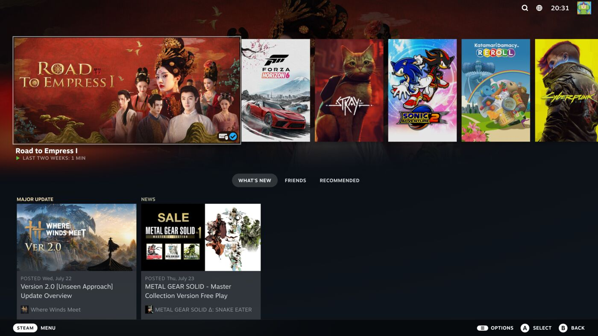

# xsync

**Play Xbox Game Pass games on Linux as if they were native Steam games.**

Game Pass has no Linux client, and its games can't run under Proton — the Microsoft
Store's packaging and DRM defeat Wine. The usual answer is "dual boot", which on a
living-room machine means giving up.

xsync runs Game Pass in a Windows VM with your real GPU passed through, then makes
that VM invisible. Games you install in the Xbox app show up automatically in your
Steam library with proper artwork. Pick one in Big Picture and it plays fullscreen at
native performance. Quit, and the VM shuts down so it costs you nothing.

```
Steam Big Picture ──> pick "Halo Infinite" ──> plays fullscreen, native perf
                                                        │
                                              quit ─────┘
                                                        │
                                          VM shuts down, back in Steam
```

> **Status: in development.** Built and tested on Bazzite with an RTX 4090 and a 4K TV.
>
> - `PLAN.md` — architecture and the reasoning behind each decision
> - `STATE.md` — what works, measured timings, known limitations
> - **`docs/FINDINGS.md` — read this before changing anything.** It records the
>   failure modes that cost the most to find, several of which look like something
>   entirely different from what they are: a bare `203/EXEC` that is really SELinux,
>   a PowerShell parse error that is really a missing byte-order mark, a USB attach
>   that reports success and silently gives the guest no controller.

---

## What it looks like

Every image below is a real capture from the reference machine (Bazzite, RTX 4090,
4K TV) taken during one launch-play-quit cycle. Host shots come from gamescope's own
compositor; guest shots are grabbed inside the VM and pulled back over the agent.

### 1. Pick a game in Steam Big Picture

Xbox titles appear as ordinary non-Steam shortcuts with artwork. Nothing here hints
that a virtual machine is involved.


### 2. The GPU changes hands

There is deliberately no screenshot of this step, and that absence is the point: the
host has no display at all while the guest owns the card. A capture attempt during
the handoff returns nothing, because there is no longer a compositor to capture from.

```
19:18:25  RELEASE_GPU        0000:01:00.0 -> vfio-pci
19:18:50  guest agent responded after 22s
19:19:36  interactive session ready
19:19:36  launching game: forza-horizon-6
19:19:45  phase: RUNNING
```

**85 seconds** from pressing A to the game running.

### 3. The game runs on the real GPU

Forza Horizon 6 at 3840x2160 on the passed-through 4090 — no streaming, no encoding,
no added latency.

Measured during play: **56-57% GPU at 2685 MHz, 225 W, 9.9 GB VRAM** at 4K Extreme
settings — vsync-locked with headroom to spare.

### 4. Quit, and you are back in Steam

Press **L3 + R3** (click both sticks). The game closes, the VM shuts down, the GPU
returns to the host driver, and Big Picture comes back. `Ctrl+Alt+Q` on a keyboard
does the same, and works even if the controller never reaches the guest.



**16 seconds** from quitting the game to Steam being back on screen, with the 4090
rebound to `nvidia`.

---

## How it works

Xbox games become non-Steam shortcuts pointing at `xsync-launch`. Launching one hands
your GPU to a Windows 11 VM, which drives your display directly — so there is no
streaming, no encoding, and no added latency. You get the whole GPU.

When you quit, xsync takes the GPU back, updates your Steam library with anything you
installed, and restores your session.

The trade-off: because the VM owns the GPU, your Linux session is stopped while you
play, so Steam's overlay isn't available. xsync replaces it with an exit chord read
inside the guest, plus automatic detection when a game exits.

Reading that chord is harder than it sounds. Windows hands a background process
neutral gamepad state while a game holds focus — measured here as a controller
streaming 27 packets a second with every button, trigger and stick reading exactly
zero. So the watcher reads the pad through Raw Input with `RIDEV_INPUTSINK`, which is
the documented way to receive input when you are not the foreground window.

## Requirements

- A GPU **alone in its IOMMU group** (check with `tools/xsync-doctor`)
- A CPU with IOMMU support — AMD-Vi or VT-d — enabled in firmware
- A Windows 11 licence
- An Xbox Game Pass subscription
- ~100 GB of disk, plus room for games

Currently targets **Bazzite / SteamOS-shaped systems** (gamescope session, rpm-ostree).
Other distros will need porting; the design is documented so that's tractable.

## Quick start

```bash
git clone https://github.com/brummiesteven/Xsync && cd Xsync
./install.sh
```

`install.sh` asks for what it needs and detects sensible answers for most of it — your
GPU, its HDMI audio function, which USB controller holds your gamepad, your Steam
directory. Usually you press Enter a lot. It then runs the preflight, installs the
systemd units and sudoers rule, and applies the IOMMU kernel args.

It is safe to re-run — every step checks whether it is already done — and
`./install.sh --check` reports status without changing anything.

**It is not a one-shot installer.** It stops and hands back at the points that
genuinely need a human: a reboot for IOMMU, fetching a Windows ISO, waiting out a
Windows install, and signing into the Xbox app with your own Microsoft account.

<details>
<summary>The same steps by hand</summary>

```bash
cp config/xsync.conf.example config/xsync.conf
$EDITOR config/xsync.conf       # REQUIRED — see the header of that file
chmod 0640 config/xsync.conf    # it will hold a guest password and an API key

tools/xsync-doctor              # check what's missing, fix what it tells you
sudo tools/xsync-setup install  # systemd units, sudoers rule, directories
sudo tools/xsync-setup kargs    # IOMMU kernel args
sudo systemctl reboot
```
</details>

`install.sh` prompts for all of these, but if you would rather set them yourself:
`XSYNC_GPU_PCI`, `XSYNC_GPU_AUDIO_PCI`, `XSYNC_USB_PCI`, `XSYNC_USER`, `XSYNC_UID`,
`XSYNC_STEAM_ROOT` and the CPU pinning values. PCI addresses must be the full
`0000:01:00.0` form that `lspci -D` prints.

`tools/xsync-find-usb` works out `XSYNC_USB_PCI` for you. It is the one people get
wrong: the controller has to hold your input devices, sit alone in its IOMMU group,
and be one you can live without on the host while a game runs — the whole controller
moves to the guest, Bluetooth radio included.

**Bluetooth gamepad?** It only reaches the guest if the Bluetooth radio is on that
controller, and you must pair it inside Windows once. Bluetooth pairings do not carry
between operating systems.

**Windows licensing.** `install.sh` asks for a product key and accepts blank, in which
case Windows installs unactivated — it runs fine, with a watermark and some
personalisation locked, and you can activate later in Settings. When no key is given,
setup falls back to Microsoft's published generic Pro key *purely to select the
edition*: it grants no licence and activates nothing, and it is there because
unattended setup halts on the product-key screen if no key is present at all. xsync
ships no ISO and no licence — bring your own of both.

Then build the guest:

```bash
tools/xsync-fetch-iso                 # fetch a Windows 11 ISO
# ...and the virtio-win ISO, which Windows Setup needs to see the virtio disk:
#   https://fedorapeople.org/groups/virt/virtio-win/direct-downloads/
sudo tools/xsync-install-windows      # unattended install, no TV interruption
# ...sign into the Xbox app when it comes up...
sudo tools/xsync-setup vm play        # switch the VM to GPU passthrough
```

Then launch **Xbox** from Steam, install a game, quit — and it appears in your library.

### The three VM profiles

| Profile | GPU | Use |
|---|---|---|
| `install` | none (virtio + VNC) | installing Windows, with install media attached |
| `maint` | none (virtio + VNC) | servicing the guest without taking your display |
| `play` | passed through | playing; the guest drives your screen |

`maint` is the one to know about. It boots the installed guest over VNC with the GPU
left on the host, so you can push scripts, take screenshots and inspect state without
interrupting anything:

```bash
sudo tools/xsync-setup vm maint && sudo virsh start xsync-win11
sudo virsh screenshot xsync-win11 /tmp/guest.ppm
sudo tools/xsync-setup vm play        # ALWAYS switch back
```

`xsync-session` refuses to start a game unless the domain is on `play`, so a forgotten
switch fails safely instead of tearing down your session for a VM with no GPU.

### Keeping the guest current

Windows in a VM has no route to a keyboard, so xsync adds a **`xsync: Guest
Maintenance`** entry to your Steam library. Launch it like a game and it takes the GPU,
updates the NVIDIA driver in the guest, and hands everything back. Its artwork is
generated locally by `tools/xsync-make-artwork` — nothing to download, nothing shipped.

## What doesn't work

- **Anti-cheat games.** EasyAntiCheat and BattlEye refuse to run in VMs by design.
  xsync does not hide the hypervisor and will not accept patches that do — that's
  anti-cheat circumvention, and it would get the project banned rather than fixed.
  Single-player titles, which are most of the catalogue, are unaffected.
- **Instant launch.** Booting Windows costs ~25-40s before your game appears. VM
  save/restore can't fix this because passthrough device state can't be serialised.
- **The Steam overlay during play.** By construction — see above.
- **Sub-gigabyte games may not appear.** Some Game Pass titles install to
  `C:\Program Files\WindowsApps` rather than `C:\XboxGames`, with nothing in the
  manifest marking them as games. They are identified by install size (1 GB floor,
  `XSYNC_MIN_GAME_BYTES`), so a very small title would be missed.
- **Screenshots of the guest.** With the Xbox full screen experience on, GDI
  capture returns black — the compositor is using a flip-model swapchain it cannot
  see. `xsync-screenshot.ps1` still works on the `maint` profile, and a black
  capture during play is itself useful: it means the title really is in exclusive
  fullscreen on the passed-through GPU.

## Status

This is **v0.2** and it has run on exactly one machine.

Working and measured here: the handoff, the firmware blackout, GPU release and
reclaim, library sync in **both** directions (installing a game adds it to Steam,
uninstalling removes it), artwork sync, and the exit path — including the
`Ctrl+Alt+Q` hotkey driving a real quit through the in-guest watcher, exercised
repeatedly.

v0.2 exists because v0.1's launch path was broken and its library sync had never
worked unattended. Ten defects were found and fixed; `STATE.md` lists them and
`docs/FINDINGS.md` explains each one. The ones most likely to matter to you:

- Launching resolved games through a call that requires admin, from the one code
  path that must not have it.
- `ConvertFrom-Json` does not enumerate arrays on Windows PowerShell 5.1, so a
  fix written and tested under pwsh 7 shipped a launch that started the wrong game.
- `<clock offset='localtime'/>` put the guest's UTC hours into the future when the
  host and guest are in different timezones, which breaks Microsoft Store licence
  acquisition for any title whose licence is not already cached.
- Game Pass DLC install as their own directories with their own
  `MicrosoftGame.config`, so each add-on was appearing in Steam as a game.
- Nothing stopped the host suspending mid-handoff, with the GPU bound to the VM.

Written and deployed but **still not proven**: the headless download-resume watcher
(its *detection* is now fixed and tested, but the watcher itself has never run to
completion), and the first-boot FSE step — this machine had FSE enabled by hand,
and `xsync-fse.ps1` is not known to be sufficient on its own. `tools/xsync-find-usb`
has been tested against one topology.

Known flaky: roughly 5% of guest boots never run Winlogon at all, so no desktop
appears. xsync reboots the guest once and retries, which takes it to about 0.25%;
the underlying race is a Windows one and is not fixed.

Expect rough edges on hardware that is not a 7950X with a 4090.

## Measured

On the reference machine — Ryzen 9 7950X, RTX 4090, 20 GiB to the guest, 4K TV:

| | |
|---|---|
| Trigger to game launch | ~30s (VM up 9s, guest agent 21s) |
| Quit to back in Big Picture | 5-7s |
| Forza Horizon 6, 4K Extreme | 56-57% GPU at 2685 MHz, 225 W, 9.9 GB VRAM |

That utilisation is a vsync-locked 60fps with headroom to spare, which is the point:
passthrough overhead is small enough that the guest performs close to bare metal.

## Safety

The worst thing this software can do is leave you looking at a black TV. That is
treated as the primary failure mode:

- every failure path restores your session, including unhandled crashes
- a watchdog force-recovers if the guest stops responding
- `sudo systemctl start xsync-recover.service` fixes things from SSH if all else fails

Run `tools/xsync-doctor` any time something looks wrong; it explains what it finds.

## Licence

GPL-3.0-or-later. See `LICENSE`.
